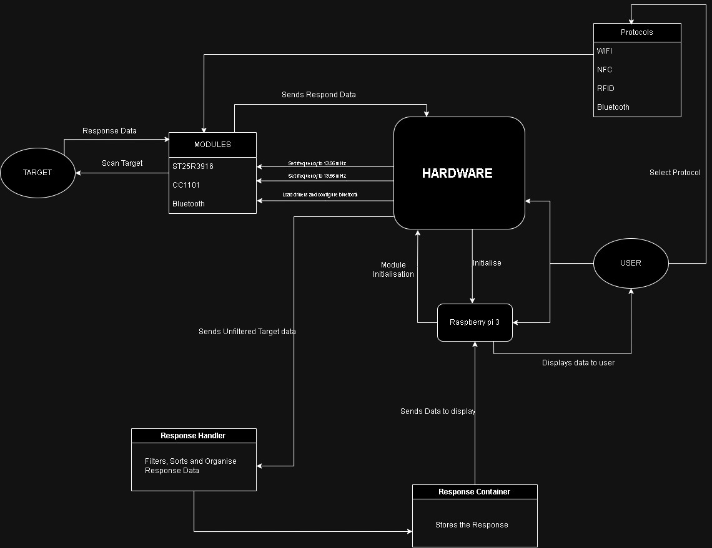

# Network Penetration Tool 

### Overview
This project aims to develop a modular **Network Penetration Testing Tool** using a **Raspberry Pi 3** integrated with various wireless communication modules such as **NFC, RFID, Bluetooth, and proprietary radio**. The tool is designed for security professionals and researchers to test wireless network vulnerabilities across multiple protocols, providing a flexible and cost-effective solution for penetration testing.

### Solution Flowchart



### Features

- **NFC/RFID Testing**: Supports scanning, cloning, and emulating NFC and RFID tags at 13.56 MHz.
- **Bluetooth Penetration**: Scans for nearby devices and performs pairing tests, sniffing, and data interception using Bluetooth LE 5.4.
- **Proprietary Radio**: Detects and analyzes signals in the sub-GHz frequency range for IoT and other wireless devices.
- **Modular Design**: Easily integrates with multiple wireless modules, allowing custom configurations.
- **Comprehensive Reporting**: Logs and reports detailed penetration test results, helping in the identification and analysis of network vulnerabilities.

### Hardware Components

1. **Raspberry Pi 3**: Central processing unit for managing modules.
2. **NFC Transceiver - ST25R3916**: Handles NFC and RFID communications.
3. **Bluetooth LE Module**: Supports Bluetooth 5.4 scanning and penetration.
4. **Proprietary Radio Module - CC1101**: Detects sub-GHz radio signals.
5. **Additional Sensors**: For future integration of IoT devices and other sensors.

### Installation

#### Prerequisites

- **Raspberry Pi 3** running the latest version of **Raspbian OS**.
- **Python 3.8+** installed on the Raspberry Pi.
- Libraries and drivers for the connected modules.
- Basic familiarity with terminal commands.

#### Setup

1. Clone this repository onto your Raspberry Pi:
    ```bash
    git clone https://github.com/yourusername/network-penetration-tool.git
    cd network-penetration-tool
    ```

2. Install the necessary dependencies:
    ```bash
    sudo apt-get update
    sudo apt-get install python3-pip
    pip3 install -r requirements.txt
    ```

3. Load the required drivers for the NFC, Bluetooth, and proprietary radio modules. Drivers for **ST25R3916**, **Bluetooth**, and **CC1101** must be installed.

4. Run the tool:
    ```bash
    python3 main.py
    ```

### Usage

1. **Initialize**: Power on the Raspberry Pi 3, load drivers, and initialize all modules.
2. **Select Protocol**: Choose the wireless protocol to test (NFC, RFID, Bluetooth, or proprietary radio).
3. **Scan Devices**: The tool scans the environment for devices or tags based on the selected protocol.
4. **Run Penetration Tests**: Depending on the protocol, perform actions such as cloning NFC/RFID tags, sniffing Bluetooth communications, or analyzing radio signals.
5. **Review Reports**: View or export a detailed report of detected vulnerabilities and test results.

### Contributing

We welcome contributions to improve the functionality and features of this tool. Please follow these steps:

1. Fork the repository.
2. Create a new branch for your feature or bug fix:
    ```bash
    git checkout -b feature-branch
    ```
3. Commit your changes:
    ```bash
    git commit -m "Add new feature"
    ```
4. Push to your branch:
    ```bash
    git push origin feature-branch
    ```
5. Open a Pull Request to merge your changes into the main repository.

### License

This project is licensed under the **MIT License** - see the [LICENSE](LICENSE) file for details.

### Acknowledgments

- **Flipper Zero** and **Hak5 Wi-Fi Pineapple** for their open-source references in wireless penetration testing.
- **Raspberry Pi Foundation** for creating a robust and affordable computing platform.
- Community contributors who have helped refine this project.
